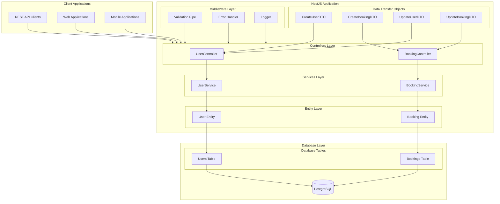
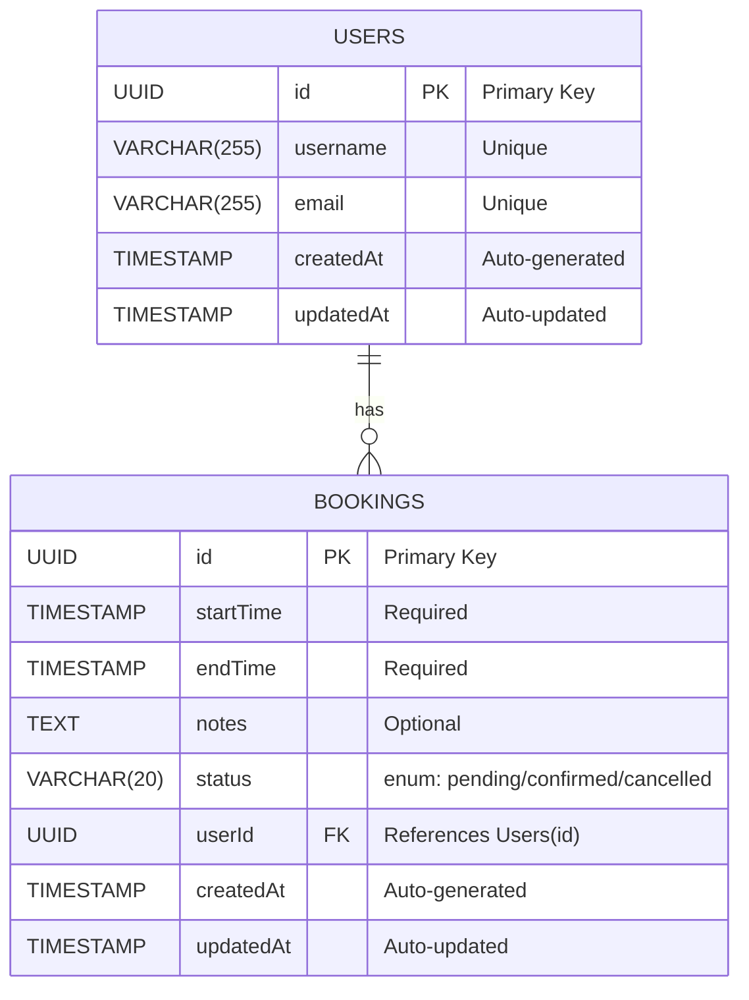
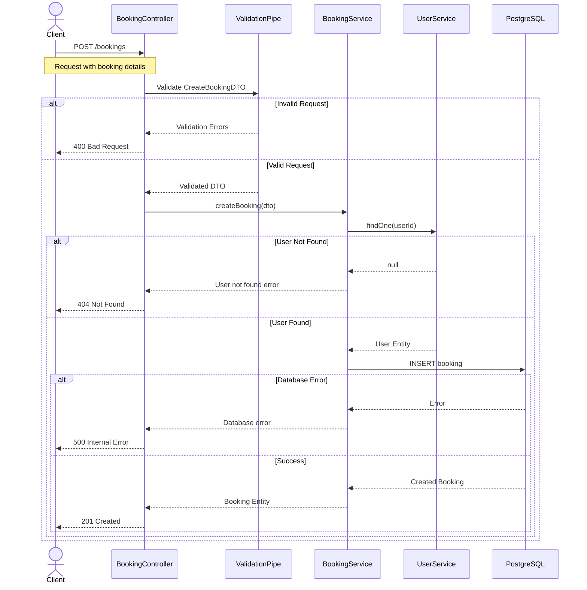

# Booking API System Documentation

## Overview

The Booking API is a robust NestJS-based system designed to manage user bookings efficiently. It provides a RESTful API interface for creating, managing, and tracking bookings with user authentication and real-time status updates.

## System Architecture

### Architecture Diagrams

#### System Component Diagram



#### Database Schema



#### Booking Creation Flow



### Key Components

1. **API Layer (NestJS)**

   - Controllers for handling HTTP requests
   - Services for business logic
   - DTOs for data validation
   - TypeORM entities for database mapping
   - Middleware for request processing

2. **Database Layer (PostgreSQL)**
   - User management
   - Booking records
   - Relationship management
   - Data persistence

### Features

- User Management (CRUD operations)
- Booking Management (CRUD operations)
- Data Validation
- Error Handling
- Database Relationships
- UUID Generation
- Timestamp Management

## Database Schema

### Users Table

```sql
CREATE TABLE users (
    id UUID PRIMARY KEY DEFAULT uuid_generate_v4(),
    username VARCHAR(255) UNIQUE NOT NULL,
    email VARCHAR(255) UNIQUE NOT NULL,
    createdAt TIMESTAMP DEFAULT CURRENT_TIMESTAMP,
    updatedAt TIMESTAMP DEFAULT CURRENT_TIMESTAMP
);
```

### Bookings Table

```sql
CREATE TABLE bookings (
    id UUID PRIMARY KEY DEFAULT uuid_generate_v4(),
    startTime TIMESTAMP NOT NULL,
    endTime TIMESTAMP NOT NULL,
    notes TEXT,
    status VARCHAR(20) DEFAULT 'pending',
    userId UUID REFERENCES users(id),
    createdAt TIMESTAMP DEFAULT CURRENT_TIMESTAMP,
    updatedAt TIMESTAMP DEFAULT CURRENT_TIMESTAMP
);
```

## API Endpoints

### User Endpoints

- `POST /users` - Create a new user
- `GET /users` - Get all users
- `GET /users/:id` - Get user by ID
- `PATCH /users/:id` - Update user
- `DELETE /users/:id` - Delete user

### Booking Endpoints

- `POST /bookings` - Create a new booking
- `GET /bookings` - Get all bookings
- `GET /bookings/:id` - Get booking by ID
- `PATCH /bookings/:id` - Update booking
- `DELETE /bookings/:id` - Delete booking

## Technical Stack

- Framework: NestJS
- Database: PostgreSQL
- ORM: TypeORM
- Language: TypeScript
- API Style: REST
- UUID Generation: uuid_generate_v4()
- Date Management: Native JavaScript Date

## Setup and Installation

1. Clone the repository
2. Install dependencies: `npm install`
3. Configure database in `app.module.ts`
4. Run migrations: `npm run typeorm:run-migrations`
5. Start the server: `npm run start:dev`

## Future Enhancements

1. Authentication & Authorization
2. Input Validation Enhancement
3. Rate Limiting
4. API Documentation (Swagger)
5. Unit & Integration Tests
6. Logging System
7. Caching Layer
8. Real-time Notifications
